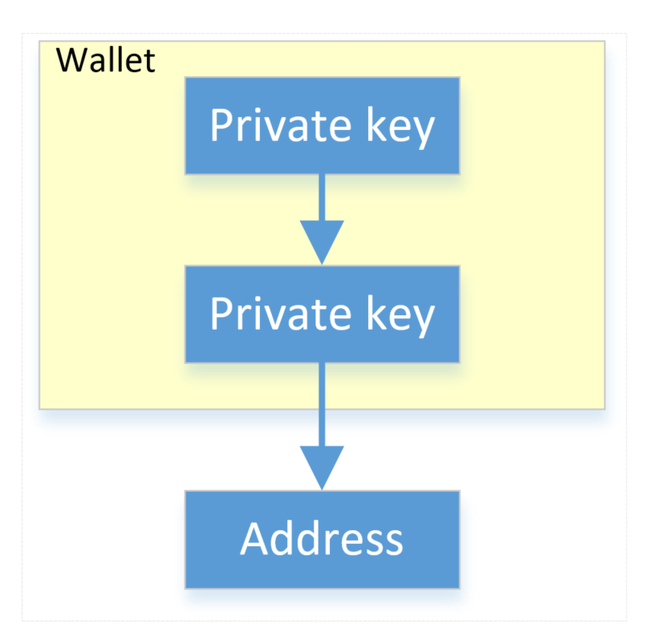
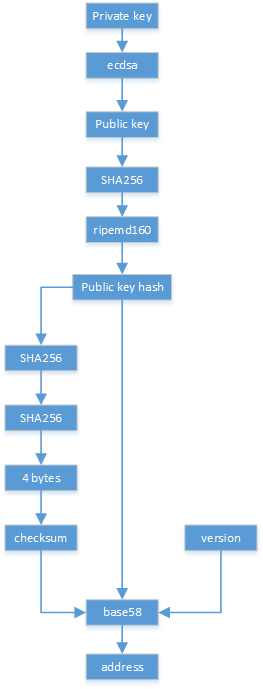

# A blockchain implementation in golang

## Blockchain Module

## Network Module

## Client Module

## Wallet Module

The wallet module is used to create the identity of the participant using the Elliptic Curve Digital Signature Algorithm(ECDSA). The details of the ECDSA can be learned from this [website](https://www.certicom.com/content/certicom/en/10-introduction.html). 

As show in the following picture, the main function of the wallet is to generate the identity of the participant. The identity is a string which is called *address*. The address is hash of the public key. The private key and public key pair is generated using the Elliptic Curve Digital Signature Algorithm(ECDSA). The details of the ECDSA can be learned from this [website](https://www.certicom.com/content/certicom/en/10-introduction.html). The public is derived from the the private key and can be distributed to other entities. The private key is used to sign the transactions or blocks. 

 

The details of the address generation is shown as following:

[Base58](https://en.bitcoinwiki.org/wiki/Base58) is a group of binary-to-text encoding schemes used to represent large integers as alphanumeric text. It is mainly designed for the Bitcoin address.  Compared with Base64, it removes number 0 (zero), O (capital letter O), number 1 (one), I (capital letter I), and the characters "\+" and "/" for better readability.

The 160-bit [RIPEMD-160](https://en.wikipedia.org/wiki/RIPEMD) hashes (also termed RIPE *message digests*) are typically represented as 40-digit hexadecimal numbers.

The `func ValidateAddress(address string) bool` is to verify the format of the address by checking its *version* and *checksum*. In details, it decompose the address to check its hash, version and checksum. The generation of the address is the reverse process of the `func (w Wallet) Address() []byte`.
